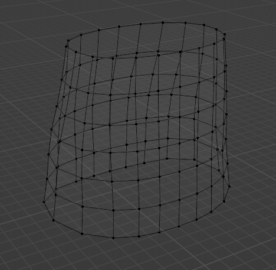
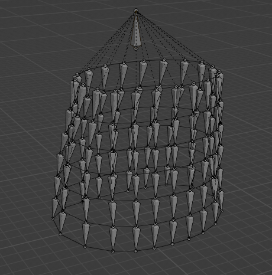

# Auto rigging for clothes simulation

## Skirt rigging
```
1. Create skirt object
- The mesh must be consisted of quads only
- The mesh must have circle shape around origin
2. Run the scripts by copy the codes
3. Select "skirt_rig" bone and set the "root" bone to suit your taste
```

## Skirt Object Preview
| Skirt Mesh | After Skirt Auto Rigging |
|--------------------------|-----------------------|
|  |  |